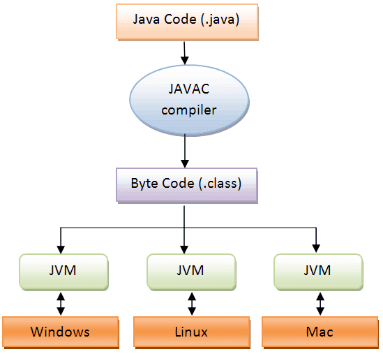
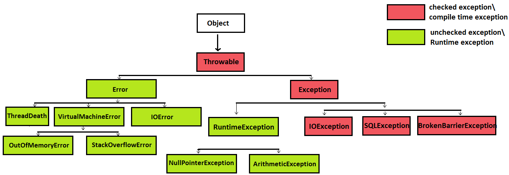

- javac           Java compiler, .java to .class
- java             Create JVM and executes program
- jar               Archiver
- javadoc      Generate documentation

> Java 11 de JRE artık yok. Ya kullanıcıya JDK indirteceksin, ya da gerekli modülleri uygulaman içinde paketleyeceksin.

.class dosyası içinde "bytecode" vardır.

- package ilk cümledir.
- package 1 tane olur.
- bir sınıfta package adı satırı olmayabilir.

Yorum yazmak için;
 - //
 - /* ... */
 - /** ... */      Javadoc commenti!

Temel sınıf tanımı 
- class Test{}

Kodu derlemek ve çalıştırmak için; Burada dikkat et, java accepts the name of the class as a parameter. Java DONT accepts the filename of the .class file as a parameter.

- javac Zoo.java
- java Zoo

> java SINIF_ISMI PARAM1 , java komutundan sonra sınıf adı gelir !!!!

Java 11 de ise tek sınıftan oluşan dosyaları derlemeden direk şöyle çalıştırabiliriz;

- java SingleFileZoo.java

Bu yöntem .class dosyası oluşturmaz. Sadece JDK içindeki sınıfları import edebiliriz.

Paket içindeki birden fazla java dosyasını ise ard arda yazarak veya * işareti ile topluca derleyebiliriz.  

```sh
  javac packagea/ClassA.java packageb/ClassB.java   // veya
  javac packagea/*.java packageb/*.java 
  java  packageb.ClassB
```

  Bu örnekte kaynak dosyalarının root klasöründen bu komutarı veririz. Farklı bir klasörde isek "-d" ile şu klasörden itibaren aramaya başla diyebiliriz. 

```sh
 javac -d classes packagea/ClassA.java packageb/ClassB.java

 javac classes/packagea/ClassA.java classes/packageb/ClassB.java   // ikisi aynı
```

Çalıştırmak için ise class-path değişkenini vermemiz gerekir.

```sh
java -cp classes packageb.ClassB
java -classpath classes packageb.ClassB
java --class-path classes packageb.ClassB
```

İçinde .class dosyaları olan bir jar dosyasını çalıştırmak için ise;

```sh
java -cp ".;C:\temp\someOtherLocation;c:\temp\myJar.jar" myPackage.MyClass

java -cp "C:\temp\directoryWithJars\*" myPackage.MyClass
```

İlk komutta önce bulunduğun klasördeki java dosyaları, sonra bir dizindeki package lar, son olarak ise jar dosyası içindeki package'lara bak diyoruz. İkinci komutta ise ilgili dizindeki bütün jar dosyalarını kastediyoruz.

Jar dosyası oluşturmak için ise;

```sh
jar -cvf myNewFile.jar .

jar -cvf myNewFile.jar -C dir .   // klasör belirterek
```

Önemli parametreler şöyledir;

- javac, classpath için -cp or a directory with -d
- java, classpath için -cp, -d and -p are used for module
- jar -cvf
-  -cp, -classpath, --class-path , üçüde aynıdır.

1 ile 5 aynı

Instance variables
1- instance variables
2- instance attributes
3- instance fields, veya fields
4- nonstatic variables
5- object fields

Statik değişkenler
1- Static variable
2- Class variable

Static attributes
1- class fields
2- class methods

Parametreler
1- method paramethers            metod tanımındaki değişken tipleri
2- method arguments		 tanımdaki değişkene gönderilen literal değerler.
3- command-line paramethers
4- command-line values

- Bir java dosyasında bir tane public class veya interface olur. Hiç public class olmayabilir de. Ayrıca bu isim dosya ismiyle aynı olmak zorundadır.

public static void main(String[] args) {
public static void main(String args[]) {
public static void main(String... args) {

public ve static yer değiştirebilir. Metod final metod ise public ile final da yer değiştirebilir.

public static void main(String args[]) {
static public void main(String args[]) {

final public static void main(String args[]) {
public final static void main(String args[]) {

public static final void main(String args[]) {
final static public void main(String args[]) {


- package içinde olmayan sınıflara sadece aynı klasördeki classlar erişebilir. Paketli sınıflar erişemez.
- import static org.oracle.b
- import static org.oracle.* sadece fieldlar ve memberlar
- Aynı sınıf importlarda varsa kod derlenmez!
- Fakat aynı sınıf import edilirken biri sınıf ismi ile diğeri de wildcard ile import edilmişse sınıf ismi önceliği alır ve kod derlenir!

Access-modifier kapsamları, büyükten küçüğe
public
protected
default
private

protected, "same package" veya "different package but derivated" a ulaşabilir.

- Local variables ve method parameters access-modifier almaz.
- Sınıfın üyelerini access-modifier sız tanımlarsak sadece aynı pakettekilere ulaşabilir.
- Sınıfın kendisini access-modifier sız tanımlarsak sadece aynı paketteki sınıflara ulaşiabilir.

- Top-level class sadece public veya default-access modifier alabilir.

non-access modifiers
1- static
2- final
3- abstract
4- syncronized
5- transient
6- volatile
7- native

Abstract class
- new ile yaratılamaz.
- içinde hiç abstract metod olmayabilir

Abstract interface
Her interface abstract dır. Aşağıdaki ikisi aynıdır.
- interface{}
- abstract interface{}

Abstract Metod
- body almayan metod

Abstract variable
- abstract variable olmaz!!!

Final Keyword
- Final class         --> cant extend by another class
- Final interface     --> olmaz, derlenmez. Default olarak abstract tır
- Final variable      -->  - tek bir kez değer atanır
			   - farklı satırlarda değer atanabilir
			   - final referance variable'a atanırsa, metodları çağrılabilir ama new ile tekrar atanamaz.
- Final method        --> üretilmiş sınıfı tarafından override edilemez.

Static Keyword
- static variable     --> sınır yaratılmamış olsa bile halihazırda oluşur.
- static method	      -->  - sınıfın instance variable'larına ulaşamazlar
			   - static değişkeni manüpile etmek için kullanılırlar. Ayrıca utility ve helper metod yazmak için kullanılırlar. Sadece metodu çağırmamız gereken ve sınıfın instance elemanları ile işimizin olmadığı durumlarda kullanılırlar.
			   - private değil ise kalıtımla miras kalırlar. Fakat override edilemez, sadece yeniden tanımlanırlar

- Sadece global olan alanlara statik özelliğini verebiliriz.
- Yerel değişkenlerin statik olma özellikleri yoktur.
- Statik alanlar, bir sınıfa ait olan tüm nesneler için aynı bellek alanında bulunurlar.

** Bir metod hem static hem abstract olamaz
** Top-level class veya interface, static olamaz.

1. A top level class (i.e. a class not defined inside any other class) can only be public or have default access. (ve abstract , final alabilir sadece)

# Chapter-2
Değişkenler ikiye ayrılır;

- Primitives
- Referance variables


Yukardaki bütün sayıların negatif değerleri de bulunur.(Sayılar signed dır) Bu yüzden yukardaki bit değerlerinin biri işaret bitidir. Mesela byte 8 bittir. 2 üzeri 8 = 256 adet sayı. Fakat bir bit işaret, 2 üzeri 7 128 dir. -128 ile +127 arasındaki değerleri alır. 127 olmasının sebebi 0 sayısıdır. Aynı şekilde 16 bit olan short da 32768 ile 32767 arasında değerler alır. char ise işaretsizdir. 0 ile 65535 arasındaki sayıları alabilir. 

binary     --->   0b100001011 veya 0B100001011
octal        --->   041321532 (başında 0 var ise, sayılar ise 0-7 arasında)
hexVal    --->   0x10B veya 0X10B
long        --->   342l veya 342L
float        --->   17.2f veya 17.2F
double    --->   3.0d veya 3.0D


- A class variable of type long defaults to "0L". Soruda sonuna harf koyuluyor.
- Java7 ile underscore kullanarak literal değerleri gruplandırma özelliği gelmiştir. 

Numeric literal kuralları;
- You can't start or end a literal value with an underscore.
- You can't place an underscore right after the prefixes 0b, 0B, 0x, and 0X, which are used to define binary and hexadecimal literal values.
- You can place an underscore right after the prefix 0, which is used to define an octal literal value.
- You can't place an underscore prior to an L suffix (the L suffix is used to mark a literal value as long).
- You can't use an underscore in positions where a string of digits is expected.

Floating pointlerdeki kurallar ise;
- You can't place an underscore prior to a D, d, F, or f suffix (these suffixes are used to mark a floating-point literal as double or float).
- You can't place an underscore adjacent to a decimal point.

int i = test() / (j = 2); 	Bu satırda önce test çalışır.
float z = 3.234_567f;		Bunlar VALID.
int x = 1____3;			Bunlar VALID.

Character  --->  \u0000 ile \uffff arasındadır. Tanımlanınca default değeri "\u0000"
	char c1 = 'D'
	char c2 = -10  // derlenmez, ama cast ile atanabilir.

Değişken isimlendirme kuralları;


- a single underscore is no longer allowed as an identifier as of Java 9
- Özetle değişken isimleri harf, sayı, para birimi simgesi veya underscore dan oluşur. Tek istisna ilk harf sayı olamaz ve tek olarak underscore olamaz ve java keyword'ü olamaz.
- a period (.) is not  allowed in identifiers

Assignment operators
a += b    --->   a=a+b
a =+ b   --->   böyle birşey yok
c=a=b=10  --->   OK
int c= b+2  ---> OK
int c +=2   --->  NOT

- Büyük değerler küçüğe sığmaz fakat tersi çalışır.
     int = byte , long = int
- Büyük küçüğe cast edilerek atanabilir ancak. Fakat bu durumda küçüğün deüeri taşabilir. Taşma yaşanırsa küçük tipin değeri negatif olur!
- result++    >     orjinal value          > sonra işlem , geçerli değeri işlemde yaz, sonra değerini arttır. Yani bir eşitlikte 2 yaz, ama değeri başka yerde görürsen 3 olarak ata.
- ++result    >     incremented value      > önce işlem
- The return value of an assignment operation in the expression is the same as the value of the newly assigned variable.
- System.out.println(a=5)    		5 yazar. Atanan değer yazılır!
- System.out.println(sayi += 2);	sayi ilk değeri 2 ise, 4 yazar!
- &&   eğer ilk koşul false ise , 2. koşul asla çalışmaz!! Mesela if(false && e++ > 10) eşitliğinde e'nin değeri hiçbir zaman artmaz.
- float ve double'a integerlar atanabilir, karşılaştırma yapılabilir.
- float, double değerler consola yazarken sayının sonunda f veya d yazmaz! 0.0 şekilde yazar.
- casting floating point numbers to integral values results in truncation, not rounding. Yani double 2.9 değerini int değere atarsan int değer 2 olur!

Operatör öncelikleri;


### Java operatör türleri

- Unary (tek parametreli)
- Binary (iki parametreli)
- Ternary (üç parametreli)

**İşlem Öncelikleri**

Önce Unary, sonra binary ve ternary  

System.*out*.println(12+1>4+2);
  //Comparison Expressions < Mathematical Expressions 

**boolean** a = **false**;

  System.*out*.println(a==1>2);
  // == less than >


**Primitive Kuralları**

1. Anything bigger than an int can NEVER be assigned to an int or anything smaller than int ( byte, char, or short) without explicit cast.

2. CONSTANT values up to int can be assigned (without cast) to variables of lesser size ( for example, short to byte) if the value is representable by the variable.( that is, if it fits into the size of the variable).

3. operands of mathematical operators are ALWAYS promoted to AT LEAST int. (i.e. for byte * byte both bytes will be first promoted to int.) and the return value will be AT LEAST int.

4. Compound assignment operators ( +=, *= etc) have strange ways so read this carefully: 

A compound assignment expression of the form E1 op= E2 is equivalent to E1 = (T)((E1) op (E2)), where T is the type of E1, except that E1 is evaluated only once.

Note that the implied cast to type T may be either an identity conversion or a narrowing primitive conversion.

For example, the following code is correct: 

short x = 3;
x += 4.6; 

and results in x having the value 7 because it is equivalent to: 

short x = 3;
x = (short)(x + 4.6);

**Numeric Promotion**

- If two values have different data types, Java will automatically promote one of the values to the larger of the two data types.
- If one of the values is integral and the other is floating-point, Java will automatically promote the integral value to the floating-point value’s data type.
- Smaller data types, namely, byte, short, and char, are first promoted to int any time they’re used with a Java binary arithmetic operator, even if neither of the operands is int.
- After all promotion has occurred and the operands have the same data type, the resulting value will have the same data type as its promoted operands.

**Explicit Casting**

This will not compile because a short VARIABLE can NEVER be assigned to a char without explicit casting. A short CONSTANT can be assigned to a char only if the value fits into a char.

short s = 1; byte b = s; => this will also not compile because although value is small enough to be held by a byte but the Right Hand Side i.e. s is a variable and not a constant.

final short s = 1; byte b = s; => This is fine because s is a constant and the value fits into a byte.

final short s = 200; byte b = s; => This is invalid because although s is a constant but the value does not fit into a byte. 

Implicit narrowing occurs only for byte, char, short, and int. Remember that it does not occur for long, float, or double. So, this will not compile: int i = 129L;


# Chapter-3

Scope of variables
- Local variables (also known as method-local variables)					Bir metod içindeki değişkenler
- Method parameters (also known as method arguments)						Metodun paramtereleri
- Instance variables (also known as attributes, fields, and nonstatic variables)		Bir sınıf içinde, metodların dışındaki değişkenler
- Class variables (also known as static variables)						static ile oluşturulan değişkenler

- Object sınıfında "finalize" metodu override edilerek, her sınıf GC tarafından toplanmadan önce istenen işlemler yapılabilir. Nesneler iki durumda toplanır;
1. object null'a atanınca
2. object yeniden initalize edilince

- Metod bir değer döndürüyor ise a.method(); hata vermez, dönüş nesnesi boşa gider.Ama döndürmüyor ise değişkene atanmak istenirse hata verir.

- varArgs
	int... days  --> burada days nesnesi 
 1. bir array
 2. Virgülle ayrılmış değerler olabilir!

Bir metod parametre listesinde ise;
- Bir tane varArgs olabilir
- Listedeki son değişken olmalıdır.

* Method void return type ise metod içinde return'e gerek yoktur.
* return son cümle değil ise, wont compile

## Overloading
Metod imzasını değiştirerek aşırı yüklemedir. Bu imza değiştirme kuralları şunlardır;
1- Argument list; Argümanların sayısı, tipi ve yeri değişir ise argüman listesi değişmiş olur.
* Yeri değişir iken birbiri yerine konacak tipler ile değiştirmek de kabul edilmez. Mesela int ve double parametre alan metodda bu ikisinin yerini değiştirmek yetmez, kod derlenmez. Çünkü bu değerler birbiri yerine geçebilir.
2- Return type; sadece return type değiştirilerek overload yapılamaz, kod derlenmez. 
* Bu kural aynı sınıfta veya farklı sınıflarda ama subclass veya derivated class ta ise çalışır.
3- Access modifier; sadece access modifier değiştirilerek overload olmaz. Kod derlenmez. 

## Constructors
Sınıf oluşturur ve sınıf tipinde değişken döndürür.
- Sadece class ismi ile tanımlanabilir.
- 4 access modifier alabilir.
- Başka birşey alırsa const. olmaz, metod olur. Mesela önüne sadece "void" alsa bile artık metod olur.

## Initalizer Block
Her sınıf oluşturulduğunda çalışır.
- Önce initalizer, sonra constructor çalışır!
- Bir sınıfın constructor yoksa derlenirken compiler default constructor ekler.
class{
super();
instance_var = 0;
}
- Eğer parametreli bir constructor tanımlı ise, compiler default constructor eklemez. Kod yazarken ise parametresiz sınıfın instance'ını oluşturmak istersen kod derlenmez.
- this(); ile diğer constructor lar çağırılır. Kuralları;
   - constructor daki ilk satır olmalıdır. İlk iki satır this olmaz
   - sadece diğer constructor lardan çağrılabiir, metodlar çağıramaz.

## Metod çağırma
Metodlara geçilen değer;
- primitive ise değer metod içindeki değişkene kopyalanır! Metodlar onları çağıran primitive değerleri değiştiremezler.
- nesne ise 2 durum vardır;
  - Reassign,  Metod object referance'ı tekrar atar ise "Değişiklik olmaz!"
  - State,     Metod object referance'ın bir alanını değiştirir ise "Değişiklik olur!"


# Chapter-4
- Expression lar, soldan sağa doğru türetilir!
- "==" nesnelerin adreslerini karşılaştırır
- string oluşturma yolları;
1. new String("...")       her zaman yeni instance
2. ="..."
3. "..."
4. new char[]{"p","u"}
5. new StringBuilder("...")

- String sınıfı final sınıftır, yani değiştirilemez. (Immutable)
1. sınıf içinde char array ve final olarak saklanır.
2- string metodları orjinal string'i asla değiştirmez.
3- Bu metodların sonucu hep new ile yeni String döndürür!

Metodların bazı özellikleri;
- Metodlar chap4.StringOperations.java sınıfında var.

- += operatörü string için de kullanılabilir! ( s += "A" gibi)

- indexOf metodu aradığını bulamazsa "-1" döndürür.

- indexOf 3. karakterden ara dediğinde, belirtilen karakter de dahildir.

- substring(i,j) de, i. karakter dahil, j. karakter hariç metni döndürür. (substring(3,4) bir karakter döner)

- substring(i,j) de, i>j ise "StringIndexOutOfBounds" hatası fırlatır. i=j ise boş bir string döner, hata fırlatmaz!!

- metodlarda genelde i dahil, j hariç oluyor.

  - The intern() method returns the value from the string pool if it is there. Otherwise, it adds the value to the string pool.

  > strip metodu Java 11 ile geldi. trim metodunun aynısı, ekstra olarak bir de unicode white spaceleri de siler.

String sınıfı metodları için kodda "chap4.StringMethods.java"


- String ler + ile birleştirilebilir.(concat) Bunu stringBuilder kullanarak yapar. + ile yeni bir String objesi oluşur.
* (int + int + String)  -->    4 + 2 + test   --->   "6test"
* Bu örnekte int değerler önce toplanır, sonra concat ile birleştirilir. Expression lar, soldan sağa doğru türetilir!
- (null + string)       -->    "nulltest"

## String Pool

JVM belleği esnek kullanmak için aynı sabit stringleri tekrar oluşturmaz, string pool da tutar ve aynısı var ise o nesneyi döndürür. Aynı zamanda intern pool da denir. String sınıfındaki intern metodu da ilgili string pool da var ise pool dan getirir, yoksa pool a ekler. Burada bir string compile time da tanımlanan bir sabit ise pool dan çağırılır. Ama runtime da herhangi bir hesaplama veya metod çağırarak string'i elde ediyorsa, aynı olsa bile pooldan getirmez. Çünkü runtime da hesaplanarak aynı olduğu anlaşılıyor, compile time da değil. Poolda olsa dahi oluşturulan stringler;

- += işleminde her zaman yeni bir string nesnesi oluşur. 
- new String() de her zaman yeni string oluşur. 
- String.metod da yeni string oluşur. 

Örnekler, chap4.StringPool.java

## StringBuilder (Mutable strings)
1. new StringBuilder();				default size is 16 char
2. new StringBuilder(StringBuilder);
3. new StringBuilder(50);			initial capacity of sb
4. new StringBuilder(String i);			String.length + 16

Metodların bazı özellikleri, (StringBuilder döndürür!);
StringBuilderTest.java

- sb.append(..)		bütün primitive ler, char array, stringbuilder, Object
- sb.append(object)	object nesnesinin toString metodu
- sb.append(seq, i, j) i dahil, j hariç
- sb.insert(seq, i, j) i dahil, j hariç. Sadece bir konuma ekler, default olarak append gibi sona ekleyemez.
- sb.insert(seq, "test", i, j)
- sb.delete(i, j) i dahil, j hariç
- sb.deleteCharAt(i)   i. karakteri siler sadece 
- sb.replace(i, j, seq) i dahil, j hariç
- sb.reverse  ters çevirir. sb substring'i için reverse kullanılamaz!
- trim metodu yoktur!!

Sadece bu iki metod stringBuilder nesnesini değiştirmez.
- subSequence()
- subString()

## Arrays
Array bir nesnedir!!! dizi değişkeni üzerinde java.lang.Object 'in metodlarına ulaşabilirsin. 2 türü vardır, primitive ve Object;


- 2 boyutlu dizi, her elemanı 1 boyutlu dizi içeren dizidir.
- Multidimentional array'in her kolon ve ya satırda eşit eleman içermelidir. 

## Array tanımlama;
int arr[];
int []arr;
String[] arr;

int[][] arr;
int arr[][];
int [][]arr;
int[] arr[];

arr = new int[2];	Burada 2 integer(char,byte,short,int) literal veya değeri üretilmiş bir değişken olabilir.
arr = new int[2][];	OK
arr = new int[][2];	Derlenmez!

- Array elemanı remove edilemez!!!

int arr[] = {0,1};
int arr[] = new int[] {0,1};    yukardaki ile aynı
int arr[][] = new int[][] { {0,1} , {3,4,5} };

1. Array tipi interface olabilir.		O interface'i implemente eden herşey
2. Array tipi abstract class olabilir.		O class'ı extend eden herşey
3. Array tipi object olabilir.			Bütün herşey

MyInterface[] interfaceArray = new MyInterface[]{
		new MyClass1(),
		null
	};

Vehicle[] vehicleArray = { 
		new Bus(),
		null
	};

Object[] objArray = new Object[] {
		new MyClass1(),
		null,
		new Car(),
		new java.util.Date(),
		new String("name"),
		new Integer [7]
	};

intArr.length		length değişkeni dizideki eleman sayısını verir.
intArr.clone()  	Clone metodu arrayin tipi ne ise aynısını döndürür.

## Length
string.length()		metod
arr.length		variable (public final int)

## Arrays class

Arrays sınıfı yardımcı metodlar sağlar. Parametre olarak 

- Arrays.equals()	        true	 false
- Arrays.compare()	    0	       Positive or negative number
- Arrays.mismatch()	 -1	      Zero or positive index

## ArrayList(java.util.ArrayList)
- Değişken boyutlu dizidir. Eleman eklenir, çıkarılır ve initial size gerekmez.
- Ekleme sırasını korur!!!
- null eklenmesine izin verir
- aynı kayıtların eklenmesine izin verir
- Default capacity is 10
- İç yapısında değerleri standart bir array de saklar. Bu array tipi Object tir.

List<String> list = new ArrayList<>();
List<int> liste = new ArrayList<>();		Primitive type lar derlenmez!

Java7 ile ikinci diamond içindeki type mecburi değildir.

ArrayListMetods.java da metod kullanımları var.
boolean a = list.add("...");			en sona ekler.
boolean a = list.add(int i, "...");		i. pozisyona sona ekler, i. posizyondaki artık eklenmek istenen olur. Eskisi bir yukarı kayar.
contains()					Eşitliği test etmek için nesnenin equals metodunu kullanır.
indexOf()					Eşitliği test etmek için nesnenin equals metodunu kullanır.
lastIndexOf()					Eşitliği test etmek için nesnenin equals metodunu kullanır.
addAll(int i , collection)			Bir diziyi, diğerine ekler. i. pozisyondaki elemanı kaydırır, coll u ilk elemandan itibaren ekler.

ArrayListReferance.java da list referance var.

List chimpanzees = new ArrayList<Integer>(); kodunda chimpanzees nin türü Object'tir. ArrayList in tipine bakmaz.

## Loops
- Enhanced for loop	for(String tmp : arrList)
- ListIterator 		arrList.listIterator()
Yukardaki ikisi eklenme sırasına göre elemenlarda döner. Aralarındaki fark ise iterator ile remove yapabiliriz.

##List eleman update
String oldValue = list.set(int i , "...")	i. elemanı update eder. Değiştirilen eski değeri döner.
 veya
List içinde StringBuilder var ise, for ile dönüp istediğimiz değişikliği yapabiliriz.

String removeValue = list.remove(int i)		i. elemanı siler ve silineni döndürür.
boolean val = list.remove(Object o)		objeyi ilk bulduğu yerdekinin siler. Bulmak için nesnenin equals metodunu kullanır. StringBuilder da equals obje adreslerini karşılaştırır, o yüzden silemez.
lit.clear()					bütün elemanları siler.
list.contains(Object)				Object'in equals metodu ile arar.
list.indexOf(Object)				Object'in equals metodu ile arar.
list.lastIndexOf(Object)			Object'in equals metodu ile arar.
list.clone()					Element referansları kopyalanır, nesnelerin kendileri kopyalanmaz. Bakınız; Shallow copy


Object[] kopya = list.toArray();		Bütün elemanları yeni bir diziye kopyalayıp döndürür.

# Chapter-5
## if
- if kelimesinden sonra süslü parantez açılmazsa sonraki satır if in olur. Eğer iç içe süslü parantez yazılmazsa zincir yapabilirsin. zincir iflerle veya for döngüsüyle yapılabilir. Mesela;
if()
  for(;;)
     syso(...)

Atama işlemi sonucu, atanan değeri evaluate eder. Mesela;
if(b=true)  --->  true   döndürür.

Örnekler; IfTest.java

## switch
switch keyword'ü eşitliği test etmek için equals kullanır. Alabileceği değerler;
switch(var)
  case a:
    break;
  case b:
    break;
  default:
    break;

Burada default'un yeri farketmez, caseler arasında olabilir.


Yukardaki tiplerde long, float, double olmadığına dikkat et. Bunların wrapperları da yoktur.
> Yukardaki tiplere Java 10 ile var da eklenmiştir. Sadece var ın içindeki type, listelenenlerden biri ise izin verilir.

Case değerleri;

1. Kod compile edildiğinde üretilen değişkenler,
 - case 10*7   OK
 - case b+c    NOT (b final ise ve sonradan atanmamış ise derlenir. effectively final olmalı)
2. case değeri switch argümanına atanabilir olmalıdır.
 - switch(byte)
      case int:    NOT
3. case null olamaz, kod derlenmez.
4. break herhangi bir case de kullanılabilirken, continue kullanılamaz. 

## for
for(initalizion; condition; update)
- init, cond, update hepsi optional dır, yazmasan da derlenir. 
- init kısmında multiple variable declaration olabilir, ama hepsi aynı tip olmalıdır. Birden fazla int tanımıda olmamalı sadece şu şekilde yazılmalıdır, int i=0, y=0
- init kısmında tanımlanan değişken sadece for içinde geçerlidir!
- condition tek olmalı
- update, multable olabilir, metod çağırabilir, göründüğü sırayla çağrılır


## enhanced for(foreach)
- Şu tiplerde kullanılabilir. Primitive array or any class that implements java.lang.Iterable.
- elemanları silemez.
- diziyi initalize edemez, elemanları değiştiremez.

Elemanları değiştirmek istiyorsak;
- primitive dönüyorsa birşey değişmez.
- object dönüyorsa değişir(yeni instance atanmaz ise)

## while
while(boolean or Boolean){
}

> Since Java 10, var is supported in both switch and while loops

## do while
do{

} while(boolean or Boolean)

Burada boolean değer do-while içinde tanımlanırsa kod derlenmez. Do-while içi farklı bir alan, dikkat et.


## labelled statements
break label1;   ---> label1:
continue label2;   ---> label2:

Label adı "label" olamaz, kod derlenmez.
Labellar şu yerlere konabilir;

- A code block defined using {}
- All looping statements (for, enhanced for, while, do-while)
- Conditional constructs (if and switch statements)
- Expressions
- Assignments
- return statements
- try blocks
- throws statements

continue sadece şuralarda kullanılır.
- for
- while
- do-while
- break label'da kod label'ın kapattığı kod parçasına gider.(label'ın tanımlandığı son kod)
- continue ise tam tersi, label'ın tanımlandığı kod'un devamını getirir.
- continue label da ise, label'a gider ve diğer iteration'a geçer.

## Unreachable code

Yukarda anlatılan karar mekanizmalarının hepsinde  break, continue, and return kullanımından ötürü kodun bazı kısımları hiç çalışmayabilir. Bu gibi durumlarda kod derlenmez! Mesela;

if(checkDate>100) {
      break;
      checkDate++;  // DOES NOT COMPILE
   }


# Chapter-6
- Bir sıfını inherit etmek için "extends" keywordü kullanılır
- Bir sıfını inherit etmek = subclassing

Employee                Programmer extends Employee
- superclass		subclass
- base class		derivated class
- parent class		extended class
			child class
(A programmer IS-A Employee)

- Inheritance bir sınıfı extend ederek uygulanır!
- Derived class, base classın değişkenlerine ve metodlarına direk olarak atanabilir.
- Inherit edilen özellikler;
 - public
 - protected(farklı paket olabilir)
 - default(sadece aynı pakette ise)
- Inherit edilmeyen özellikler;
 - private
 - default(farklı pakette ise)
 - base class constructor'ı çağrılabilir ama inherit edilmez.

Base class bir "abstract" class da olabilir. 
- abstract classın nesnesi yaratılmaz.
- hiçbir abstract metod olmasada bir sınıf abstract olabilir.
- Derivated class, base'in bütün abstract sınıflarını implemente etmelidir. 
- abstract base'in değişkenlerini 
- Subclass, super class'ının tanımladığı bütün abstract metodları tanımlamak zorundadır. Bir koşul hariç, sub class da abstract ise
- Bir sınıf bir interface implement ediyor ise o interface in bütün metodlarını tanımlamak zorundadır. Bir koşul  hariç, o sınıf abstract ise
- ? It is possible for two classes to be the superclass of each other.

## Interfaces
- Tanımı sadece abstract metod ve sabitlerden oluşur.
- Bütün üyeleri public dir.
- Inheritance sadece 1 sınıftan olur. (Programmer extends Employee)
- Fakat multiple interface implementing kabul edilir. (Programmer implements Aa ,Bb)
- Interfadeki metod imzası, implemente edilen sınıftaki ile aynı olmalıdır, yoksa derlenemez.
- Interface yazmasan da abstract'dır.
- Interface final olamaz.
- Interface içine tanımlanan değişken public, final ve static dir. (Yazılmazsa bile compiler ekler.)
- Değişkenler önüne synchronized, transient or volatile eklenemez, eklersen derlenmez.
- Interface sadece sabit tanımlanabilir. Atandıktan sonra değeri değişmez.
- Interface metodları ise public ve abstract dir. (yazmazsan ekler.)
- Metodlar statik olamaz. Çünkü Java da statik metodlar abstract olamaz.
- Metod önüne native or synchronized eklenemez, yoksa kod derlenmez. 
- Interface constructor'ı olmaz.
- interface tipinde değişken tanımlanabilir.
- interface birden fazla interface'i extend edebilir.
 - extend ettiği interface'lerde aynı isimde metod olabilir, sorun olmaz, sonuçta body yok. İmzaları farklı olabilir.

## Java8 ve Java9 Interfaces
Yukardaki kurallar değişti. Java 8 ile interface lere artık metod ekleyebiliriz. Yeni eklenen özellikler şu şekildedir;


### Default Interface Method
Interface içinde default keyword ü ile tanımlanan ve body içeren metodlara default method denir. Implemente eden sınıflarda default bir davranış getirmek için dizayn edilmiştir. Geriye doğru uyumluluğu sağlamak içindir. Sınıf default metodu override etmeyi seçebilir, etmez ise interface içinde tanımlı olan kullanılır. 
- A default method may be declared only within an interface.
- A default method must be marked with the default keyword and include a method body.
- A default method is assumed to be public. Override edenler public olmalı mutlaka!
- A default method cannot be marked abstract, final, or static.
- A default method may be overridden by a class that implements the interface.
- If a class inherits two or more default methods with the same method signature, then the class must override the method.
- Farklı interfacelerde aynı isimde iki default metod varsa kod derlenmez. Fakat implemente eden sınıf bu aynı metodu override ederse sorun yaşanmaz.
- Default metodlar extend edilen sınıftan şu şekilde çağrılabilir! "Yeni.super.varsayilanMetod("");"

### Static interface metod
- A static method must be marked with the static keyword and include a method body.
- A static method without an access modifier is assumed to be public.
- A static method cannot be marked abstract or final.
- A static method is not inherited and cannot be accessed in a class implementing the interface without a reference to the interface name. Yani normal static metodlar gibi ulaşırız. 
- Default daki gibi aynı metod imzalıların çakışması sorunu olmayacak çünkü static metodlar inherit edilmemektedir.

### Private Interface Methods
Private metodlara hiçbir şekilde erişemeyiz. O zaman neden interface lere eklendi? Sadece kod tekrarını engellemek için eklenmiştir. 
- A private interface method must be marked with the private modifier and include a method body.
- A private interface method may be called only by default and private (non‐ static) methods within the interface definition.
- Private interface methods behave a lot like instance methods within a class. Like private methods in a class, they cannot be declared abstract since they are not inherited.

### Private Static Interface Methods
Amaç yine aynı kod tekrarını azaltmak.
- because instance methods can access static methods within a class, they can also be accessed by default and private methods.
- Kuralları primitive interface metodları için aynıdır
- Both private and private static methods can be called from default and private methods.
- a private method cannot be called from a private static method


## Nesne referansı tanımlamak
  class Yonetici extends Calisan implements Calis

1- Yonetici sınıfı kendi ile tanımlanırsa           -->   Base inde ve interfacedeki bütün herşeye erişir
2- Yonetici sınıfı Base ile tanımlanırsa            -->   Sadece base ine erişebilir
3- Yonetici sınıfı interface ile tanımlanırsa       -->   Sadece interface'e erişebilir.

1- Yonetici c = new Yonetici();
2- Calisan c = new Yonetici();
3- Calis  c = new Yonetici();

** Burada ulaşılamayan herşey cast ederek ulaşılabilir!!! 

## this
1. Base sınıftaki değişkenlere ulaşmak(base kelimesi doğru yazılmış burada, yıldızı oku aşağıda)
2. Aynı sınıftaki instance variable'ları ayırmak
3. Constructor'a ulaşmak için kullanılır

## super
1. Base sınıftaki değişkenlere ulaşmak
2. Base in Constructor'ına ulaşmak için kullanılır.
 - this ve super constructor'ın ilk cümlesi olmak zorundadır.
 - yazılmamış ise compiler super ekler.

* this ve super static metodlarda kullanılamaz!
* 1. maddeler dikkat ettiysen aynıdır. Çünkü çakışan isimler varsa, this instance variable'ı, yoksa basedeki değişkeni gösterir!!
* this ve super object reference dir, her nesnede oluşturulur.

## Polymorphism(many forms - çok formluluk)
- Polymorphism "overriding" ile gerçekleşir.
- Overriding aslında IS-A ilişkisi olan sınıflar arasında aynı imzaya sahip olan metodların, üretilen sınıfa göre çağrılmasıdır.
- Aralarında inheritance olan sınıflar arasında gerçekleşir.
- Overriden metodların isimleri aynı olmalı, argüman listesi de aynı olmalıdır.
- Dönüş tipi aynı olabilir veya base class metodu abstract olabilir. 

## METHOD OVERRIDE:
Aynı fonksiyonun farklı classlarda farklı davranmasını istiyorum.
1.	Metotların imzaları aynı olacak. (Metodun adı, parametre sayısı ve tipi aynı olacak)
2.	Dönüş tipi ya aynı ya da o tipten türeyen bir tip olacak.
3.	Erişim denetleyicisi (modifier) daha geçerli olmalı. (public,protected, <default>, private) yani metodun protected sa public olabilir. Daha daraltırsa kod derlenmez!
4.	Metotlar ezilir fakat değişkenler ezilmiyor.
5.	Base metodu final ise override edilemez!
6.	Base metodu private ise override edilmiş gibi gözükebilir ama override edilmez!
7.	Static metodlar ezilmez.

** Önceki derste base i tanımlanan class lar sadece kendine ulaşabilir demiştik. Fakat ulaşılmak istenen metod aynı şekilde var ise, compiler bunun override edildiğini anlar ve cast'a gerek kalmadan derivated'dekini çağırır!

- An abstract method can be overridden. Abstract methods are meant to be overridden in the subclass. Abstract methods describe a behavior but do not implement it. So the subclasses have to override it to actually implement the behavior. A subclass may chose not to override it, in which case, the subclass will have to be abstract too.


late binding		          Derleme anında (compile-time) hangi nesneye ait yordamın çağrılacağını bilinemiyorsa
early binding	

# Chapter-7
- Stack Trace: JVM unhandled excepition alınca hangi metodları sırayla çağırdığını gösteren tracedir.
- Exception bir nesnedir! Hepsi "java.lang.Throwable" ın sub-class ıdır.
- Kod çalışırken exception olursa uygun bir sınıfta exception nesnesi oluşturulur ve JVM e verilir. JVM OS un stackine bakar ve uygun yerde hatayı verir.
- Checked Exceptions : RunTimeException'dan extend olmayan hatalardır.
- Eğer bir metod tanımında "throws Excepiton" varsa onu çağıran kodda mutlaka excepiton handler olmalıdır. Yoksa kod derlenmez.
- Finally her zaman çalışır.
- catch ve finally yerleri değişemez. Try'dan sonra ya catch ya finally bloğu olmalıdır. 
- finally hata fırlatan metodu çağırırsa, kod derlenmez. 
- Eğer try veya catch bloğun içinde "return" var ise, return bittikten sonra finally bloğu çalışır, ondan sonra devam eder.
- Eğer hem catch hem finally bloğun içinde "return" var ise, finally bloğundaki değer alınır.
- Return ederken catch bloğu finally bloğuna değişkeni/objeyi gönderir. Eğer gönderilen primitive ise finally bloğu bu değeri değiştiremez, nesne ise değiştirebilir. Son dönen finally olduğu için onun değeri kalır. 
- Birden fazla catch olduğu durumda, Exceptionlar birbiri ile IS-A ilişkisi var ise yazılma sırasının önemi vardır. Yoksa kod derlenmez. Hatırlatma için şu örnek kullanılabilir. Hata olarak tiger fırlatıldığını düşünelim. Catch de ise Animal ise yakala ve Tiger ise yakala olsun. İlk yazılan catch Base class, yani Animal olursa, fırlatılan tiger hep Animalda yakalanacak asla tiger catch inde yakalanmayak. İkinci catch hiçbir zaman çalışmayacaktır. Bu sebepten kod derlenmez. Base en sonra olmalıdır.
- Catch ile birden fazla hata yakalanabilir. "catch(Exception1 | Exception2 | Exception3 e)"
- 




## Checked Exceptions
- Programcı tarafından öngürülebilen hatalardır.
- RunTimeException ın sub-class'ı olmayan hatalardır.
- Bir metod checked exception fırlatıyor ise mutlaka onu yakalaması veya throws ile fırlatması gerekmektedir.

## Unchecked Exceptions
- Programcı hatasının sonucudur.
- Yakalanabilir ama gerek yoktur.

## Runtime Exceptions
IndexOutOfBoundsEx		invalid List position
ArrayIndexOutofBoundsEx		invalid array position
IllegalArgumentEx		invalid arguments
IllegalStateEx			for send signals for status


## NullPointerException
- Accessing members of a reference variable that is explicitly assigned a null value.
- Accessing members of an uninitialized instance or static reference variable. These are implicitly assigned a null value.
- Using an uninitialized local variable, which may seem to throw a NullPointer-Exception.
- Attempting to access nonexistent array positions.
- Using members of an array element that are assigned a null value.

** Base hiçbir exception fırlatmıyorsa derivated sadece checked fırlatabilir.

** Base hata fırlatıyorsa, child hata fırlatmamayı seçebilir. Yani child sadece daraltabilir. Child base de ki exception'ı daha da genişletemez! yoksa kod derlenmez. 

## Errors
- JVM tarafından fırlatılan environment ile ilgili hatalardır.

StackOverflowEx		bir program kendini birçok kez çağırırsa ve program için ayrılan memory stack taşarsa alınır
OutofMemoryError	JVM run out of memory on the HEAP
ExceptionInInitalizer	Sınıfın static initalizerinde oluşar her türlü hatada bu alınır. Sadece RuntimeException bu hataya sebep olabilir.
NoClassDefinitionfound	Classpath düzgün ayarlanmazsa veya compile etmeden run edilirse bu hata alınır
AssertionError	 	4 işlem metodu düşün, bu işlemlerden başkası gelir ise AssertionError fılatılır.


explicitly 	= 	açıkça
implicit 	=	üstü kapalı


