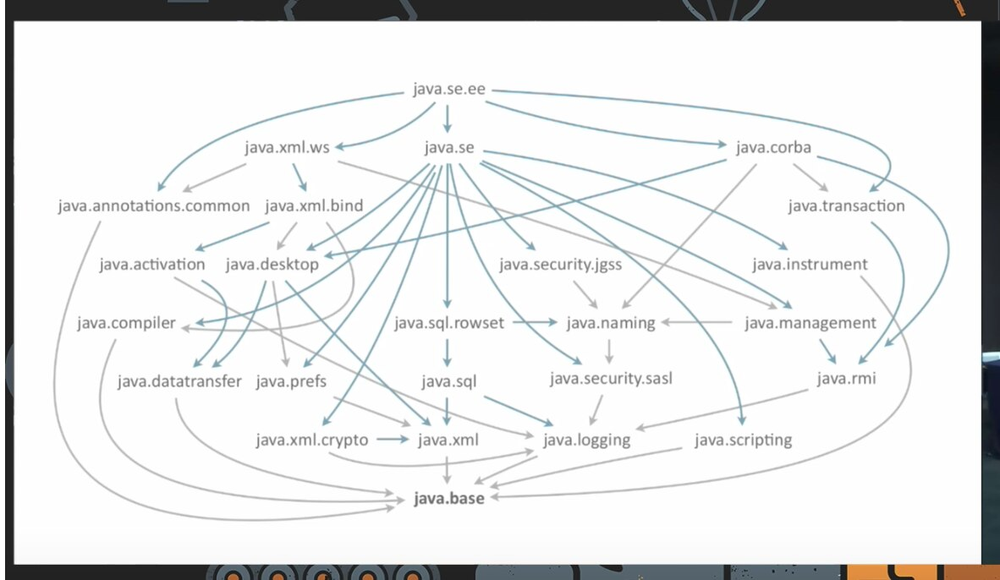
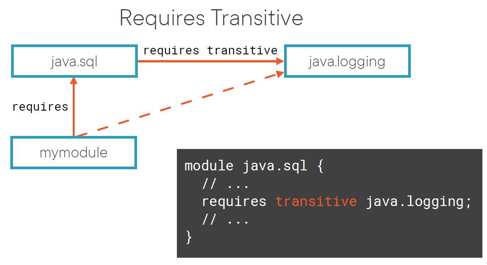
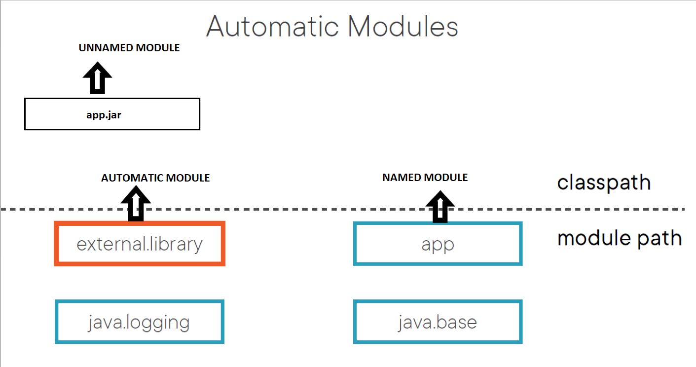

Java Modules, The Java Platform Module System, JPMS

Örnek kodlar;
https://github.com/boyarsky/sybex-1Z0-815-chapter-11

Modüller bir ismi olan, alakalı kodları gruplayan ve self-contained yapılardır. Javada bugüne kadar metod yazdık, onları sınıflara ekleyip package lar içinde yönettik. Modüller de package ları kapsayan daha üst seviye control access sağlar. Package lar gibi zorunlu değil, optional dır.

Normalde jar dosyaları ve sınıflarımızı Classpath'e ekleriz ve JVM istediği gibi bütün package ları kullanabilir. Module ile karşılaştıracak olursak;
- Jar dosyasının ismi vardır ama runtime da işe yaramaz. Classpath de sadece package lar görülür.
- Jar dosyası package lar ile kodu gruplar ama access-control yapılamaz. JVM classpath deki bütün package lara ulaşır. Moduller ile jar içindeki bazı package lara ulaşılmasını engelleyebiliriz!
- Jar içinde bağımlılık olarak başka jar kullanılıyor ise bunu hata verene kadar anlayamayız. Classpath de jarın kullandığı jarlar hali hazırda olmalıdır. Modüller ise tanımlarında ben şu package lara bağımlıyım diye tanım yapar. Veya aynı sınıf ve package ismi normalde class-path e eklenemez. Modüller içinde internal package ları dışarı kapatırsak böyle bir sorunu yaşamayız.

Modüller şu problemleri çözer;
- Bir package'a sadece belirli bir package grubunun ulaşmasını sağlamak.
- Implementasyon detaylarını saklamak. Internal sınıflara ulaşılmasını engellemek.
- Bir package'ın hangi bağımlılıklarının olduğunu belirtmek.(Mesela junit4 jarını eklersin ama arka planda hamcrest kullanır ve bunu hata verene kadar bilemeyiz.) Modül bağımlılıklarını listeler.
- Uygulamayı dağıtırken sadece uygulamamızın kullandığı sınıfları paketlemek(AWT kullanmıyorsak bunu kullanıcıya standart java dağıtımında vermemeliyiz) , uygulama boyutu küçültmek
- Startup zamanını azaltmak. Java uygulamanın hangi modüller ile çalıştığını bildiği için sınıfların yüklemesi daha kısa zaman alır.
- İki farklı jarda aynı package adınıda aynı sınıf olamazdı. JPMS bunun olmasını engeller.

JDK 8 öncesinde bütün Java Core API rt.jar(runtime kısaltması) içindeydi. Geliştirilen kütüphaneler ve hatta uygulamalar JDK nın internal API lerini kullanıyordu. JPMS bu soruna çözüm getirdi. JDK8 sonrası JVM modül yapısı şu şekildedir;

Modul "module-info.java" dosyasında tanımlanır. Tanımı şöyledir;(zoo.animal.feeding modülün ismidir!)

module zoo.animal.feeding {
}

- module-info modülün root'unda olmalıdır. Diğer java sınıfları ise paketler içinde olmalıdır. Paket içinde olmayan sınıf derlenmez.
- modül ismi package isim kuralları ile aynıdır. İsminde genellikle nokta olur ve tire olmaz. Genellikle içindeki paketlerin en uzun ortak package ismi olur.
- Module jar ise yukardaki özellikleri sağlayan jar dosyalarına denir. Jar root'unda module-info.java dosyası olan jar dosyaları modul jarıdır.

Bir java projesi oluşturalım ve src içine module-info.java dosyamız olsun. Module ismi mymodule olsun. İçine de com.test.Dene.java sınıfını yaz ve main ekle. Şimdi bunu derlemek için;

javac -d out src/com/test/Dene.java src/module-info.java

komutu bize out klasörü içine .class uzantılı 2 dosyamızı da derleyip koyar. Modülleri çalıştırmak normal cp parametresi ile çalıştırmaktan farklıdır. Çalıştırmak için;

java -p out -m mymodule/com.test.Dene

Peki bir proje içinde 2 modül olmasını istersek ne yapmalıyız? Örnek şöyle olsun. src altında iki klasör ekle. Bu klasör içinde 2 farklı modul yazacağız. Biri için örnek verecek olursak modül adımız mymodule idi. Bu durumda mymodule isimli bir klasör açıp, yukardaki Dene ve modul-info yu içine kopyala. Buradaki zorunluluk modul ismi ile klasör ismi aynı olmak zorundadır. Ardından derleme komutumuz artık şöyle değişir;

javac -d out --module-source-path src -m mymodule,mymodule2

Çalıştırmak ise aynı şekildedir.

Derlemek için aşağıda farklı yöntemler mevcut, bütün komutlar aynıdır;

javac -p mods -d feeding
   feeding/zoo/animal/feeding/*.java
   feeding/*.java
 
javac -p mods -d feeding
   feeding/zoo/animal/feeding/*.java
   feeding/module-info.java
 
javac -p mods -d feeding
   feeding/zoo/animal/feeding/Task.java
   feeding/module-info.java
 
javac -p mods -d feeding
   feeding/zoo/animal/feeding/Task.java
   feeding/*.java

Yukarıdaki örneklerde de görüldüğü üzere dikkat etmemiz gereken husus, her java klasör path ini ayrı ayrı vermemiz zorunluluğudur. İç içe klasörler derlenmiyor.

-d Specify where to place generated class files
-p Module path "-p" yerine "--module-path" kullanılabilir. Sanırım bağımlı olduğumuz modullerin nerede olduğunu belirtiyoruz.
-m Module name "-m" yerine "--module" kullanılabilir.  Compile only the specified module(s), check timestamps

Mesela maven projem için şu komut;
- javac -p mods -d modules.hello src/main/java/test/modul/Task.java src/main/java/*.java

Burada proje rootunda "modules.hello" isimli bir klasör oluştu ve içine .class dosyalarını derledi. Çalıştırmak için ise;
- java -p klasor_adi -m module_name/test.modul.Task

Çalıştırırken -p modül klasörü path'i, module_name modülün adını temsil eder.(module-info daki ismi) Çalıştırma syntax'i "moduleName/className" şeklindedir. Paketlemek için ise;
- jar -cvf mods/modul_paketi.jar -C modules.hello2/ .

Bu normal bir komut. modules.hello klasörü içindeki herşeyi, mods klasörü altında modul_paketi.jar dosyası olarak paketler.
- c create jar
- v verbose output(Jar toolunun yaptığı işleri, jar içine konan dosyaları listele.)
- f jar file name(burada klasör belirtirsek klasör hali hazırda olmalıdır.)
- C (-C out .) out klasörü içindeki bütün dosyaları sıkıştır.

 Jar içinden çalıştırmak için ise;

- java -p mods -m modules.hello/test.modul.Task

Diğer modüller eklemek için önce paketimizin kendini module-info.java dosyasına ekliyoruz. Aksi taktirde modül sadece komut satırından kendini çalıştırabilir. Şu şekilde eklenir;
  exports zoo.animal.feeding;
Export kelimesi modülden dışarıda olanlar için dışardan neyin ulaşılabilir olduğunu belirlemek için kullanılır. Bu sayede zoo.animal.feeding package içindeki sınıflara diğer modüller erişebilir. Bu package içindeki package lara da erişilemez. zoo.animal.feeding.test package'ı içindeki Dene sınıfına bile erişilemez.

Eğer modülümüz çalışmak için başka bir modüle ihtiyaç duyuyor ise;
  requires zoo.animal.feeding;
Burada modülümüz içindeki bazı sınıflar requires ile tanımlanan modül içindedir diyoruz. doğal olarak modülümüz bu modül olmadan çalışamaz! Bütün modüller dolaylı olarak requires java.base satırını module-info ya yazar. Yazarsan birşey olmaz, derlenir. Aşağıdaki örnekte mymodule çalışmak için util modülüne ihtiyacı var. util içindeki sınıfı kullanmaktadır. Şu şekildedir;

Bu şekilde modül içinde birden fazla modül varsa derlerken onları da sırayla yazarız;
javac -p mods
   -d care
   care/zoo/animal/care/details/*.java
   care/zoo/animal/care/medical/*.java
   care/module-info.java

Burada sıra önemlidir. module-info başta olursa derlenmez. Veya gerekli olan başka bir modül daha yukardaysa da derlenmez.

Module-info.java
Bu dosyada  exports, requires, provides, uses, and opens kelimelerini kullanabiliriz. Enteresan şekilde bunların hiçbiri Java keyword lerinden değildir. Çünkü bu kelimeler sadece module-info.java dosyası içinde geçerlidir, normal sınıflarda değişken adı vs için kullanılabilirler.

Exports
Export bir paketi diğer modüllere açmak, export etmek için kullanılır. Bunu sadece belli modüllere de açabiliriz; (dikkat export package name, to modul name)
  exports zoo.animal.talks.content to zoo.staff;

We’ve been talking about exporting a package. But what does that mean exactly? All public classes, interfaces, and enums are exported. Further, any public and protected fields and methods in those files are visible.
Fields and methods that are private are not visible because they are not accessible outside the class. Similarly, package-private fields and methods are not visible because they are not accessible outside the package.

REQUIRES TRANSITIVE(requires transitive moduleName)
As you saw earlier in this chapter, requires moduleName specifies that the current module depends on moduleName. There’s also a requires transitive moduleName, which means that any module that requires this module will also depend on moduleName. Yani aşağıdaki mymodule transitive olmasaydı hem requires java.sql, hemde requires java.logging yazamalıydı. Java.sql modulü requires transitive yaparak java.logging i eklememize gerek kalmadı. Görüleceği üzere sadece java.sql i ekledim ve altındakiler de eklendi.

- requires, requires transative aynı modül ismi için 2 defa tanımlanamaz, kod derlenmez.

Ayrıca "provides" ve "uses" keyword leri bir API sunarken veya erişirken kullanılır.

OPEN/OPENS
Export edilmeyen package lara ulaşamıyoruz. Aynı zamanda reflection kullanarak da ulaşamayız. Fakat spring, hibernate gibi framework ler reflection kullanır. Bunu aşmak için package isminin önüne "opens" yazarsak bu package'a sadece reflection ile ulaşılabilir. Eğer bütün modul tanımı önüne "open" yazarsak ise modüldeki bütün package lar dışarı export edilir.

Bazı komutlar.
Elimizde bir modül jarı var. İçini açıp module-info ya bakmadan şu komutla modül içeriğini görüntüleyebiliriz.
- java -p mods -d zoo.animal.feeding
- java -p mods --describe-module zoo.animal.feeding
Bu komut çıktısında son satırda "requires java.base mandated" yazar. Nasıl her java dosyasında java.lang otomatik import ediliyor ise, modüllerde ise java.base modülü otomatik olarak eklenir.
Çıktıda "contains zoo.animal.care.details" görebiliriz. Contains modül içinde olan fakat dışarı açılmayan modülleri belirtir.
Çıktıda "qualified exports zoo.animal.care.medical to zoo.staff" görebiliriz. qualified ise modülün tam ismini listeler.

"java --list-modules" komutu JDK içindeki modülleri listeler.
"java -p mods --list-modules" ise bizim yazdığımız custom modülleri de listeler.
Komut çıktısı genelde şöyledir. "java.*" ile başayan modül isimleri ve "jdk.*" ile başlayan modül isimleri. java ile başlayanlar Java spesifikasyonlarıdır. Jdk ile başlayanlar ise bu spesifikasyonların implementasyonlarıdır. Kullandığın JDK e göre bu modüller değişir.

Modül bilgileri daha ayrıntılarını da şu komutla alabiliriz. Bu komut aslında modülü çalıştırma komutu, sadece önüne resolution parametresi ekleniyor. Komut ayrıntıdan sonra modülü çalıştırır.
java --show-module-resolution
   -p feeding
   -m zoo.animal.feeding/zoo.animal.feeding.Task

Modül bilgisi detayı için jar komutu da kullanılabilir.
- jar -f mods/zoo.animal.feeding.jar -d
- jar --file mods/zoo.animal.feeding.jar --describe-module

"jdeps" komutu modül içindeki bağımlılıkları gösterir. (modules.hello -> java.base formatında)
- jdeps -s mods/zoo.animal.feeding.jar
- jdeps -summary mods/zoo.animal.feeding.jar

Summary kısmı olmadan da hangi modülün neye bağlı olduğunu ayrıntılı verir.
- jdeps mods/zoo.animal.feeding.jar

Bu modüle kimlerin bağımlı olduğunun ayrıntılı bilgisi
- jdeps --module-path mods mods/zoo.animal.care.jar

jmod bize jardan farklı olarak başka bir şıkıştırma formatı kullanmamızı sağlar. "jmod" komutu modülü jar yerine .jmod dosyası olarak kaydetmemizi sağlar. Genelde native library ler için veya değiştiremediğimiz jar lar için kullanılır. Komutları;
- create		Creates a JMOD file.
- extract		Extracts all files from the JMOD. Works like unzipping.
- describe	Prints the module details such as requires.
- list		Lists all files in the JMOD file.
- hash		Shows a long string that goes with the file

Sınavda javac, java, jar ve jdeps komutları parametrelerini bilmelisin.

## Özet module keywords;
- exports <package>	Allows all modules to access the package
- exports <package> to <module>	Allows a specific module to access the package
- requires <module>	Indicates module is dependent on another module
- requires transitive <module>	Indicates the module and that all modules that use this module are dependent on another module
- uses <interface>	Indicates that a module uses a service
- provides <interface> with <class>	Indicates that a module provides an implementation of a service

## 3 tip modül vardır;
Şu ana kadar hep module-path ile çalıştık, fakat eski uygulamalarımız hala class-path ile çalışmaktadır. Module sistemi ile beraber class-path aslında UNNAMED modul olmuştur. Yukarda tanımladıklarımız ise NAMED modüllerdir.
- NAMED MODULES, içinde package-info.java dosyası olan ve module-path de bulunan modüllerdir. Bu dosyada modül ismi bulunur.
- AUTOMATIC MODULES, içinde package-info.java dosyası olmayan ve module-path de bulunan modüllerdir. Modülarize değillerdir. Modül ismini java otomatik olarak set eder. Otomatik olarak bütün paketleri de export eder. Migration için kullanılırlar. Burada otomatik isim verme şu şekilde yapılır;
 - If the MANIFEST.MF specifies an Automatic-Module-Name, use that. Otherwise, proceed with the remaining rules.
 - Remove the file extension from the JAR name.
 - Remove any version information from the end of the name. A version is digits and dots with possible extra information at the end, for example, -1.0.0 or -1.0-RC.
 - Replace any remaining characters other than letters and numbers with dots.
 - Replace any sequences of dots with a single dot.
 - Remove the dot if it is the first or last character of the result.
 - _ are turned into . Dots. Special chars turn to dots, after that leading and trailing dosts removed
- UNNAMED MODULES, içinde package-info.java dosyası olmayan ve class-path de bulunan modüllerdir. Bildiğimiz standart jar dosyalarıdır. Eğer içine module-info.java dosyası eklenirse, class-path de bulunduğu için ignore edilir. Run-time da Named ve Automatic deki bütün herşeye ulaşabilir fakat kimse ona ulaşamaz, hiçbir package export etmez. Herşeye ulaşabiliyor çünkü cp kullanan eski uygulamaların kırılmaması gerekmektedir. (Modüllerde export edilmeyen package lara bile ulaşabilir.) Bu özellik run-time için geçerlidir. Compile-time da ise modullerin kullanımı için encapsülasyon uygulanmaktadır.

Bu durum reflection için de geçerlidir. Java 11 classpath de reflection da çalışır geriye doğru uyumluluk için. Sadece uyarmak için ilk defa reflection kullanılan sınıflarda artık JVM uyarı mesajı gösterir.
"WARNING: An illegal reflective access operation has occurred; WARNING: An illegal reflective access operation has occurred"
Access-restirictions ları reflection ile uygulanmadığının uyarısıdır. İlerde bu engellenecek ve uygulamamız çalışmayacaktır. Bu sorunu tespit edip uygulamamızın hata vermesini istersek "--illegal-access=deny" parametresini geçerek reflection ların access restritionu ihlal ettiği durumlarda uygulamamızın hata vermesini sağlayabiliriz. Java 16 ile default olarak deny yapılmıştır. Şu anda warn dur defaultu. Bu gibi durumlarda kullanılan kütüphanenin yeni versiyonunu indir. Yok ise geçici olarak "--add-opens" parametresini geçebilirsin.

## Modül tipleri karşılaştırma
- Class-path deki kod module-path deki sınıflara ulaşabilir.
- Module-path deki kod class-path deki sınıflara ulaşamaz. Sadece module-path'i okur.
- Automatic de module-path de olduğundan module-path i okur. Ayrıca otomatik moduller class-path e de erişebilir!

# Built-in Modules
Java 9'a kadar bir uygulama JDK nın istediği kısmını import edip kullanabiliyordu. Java 9 ile beraber uygulama JDK nın hepsini veya sadece bir subset'ini kullanacağını belirtebilir.
En önemli subset "java.base" dir. requires ile eklememize gerek yoktur, çünkü bütün modüler uygulamalara otomatik olarak eklenir. En sık kullanılan modüller;

## jdeps
jdeps komutu dependencies hakkında bilgi verir. Modülarize etmediğimiz uygulamaları bu komutla hangi modüllere ihtiyaç duyacağını kolayca tespit edebiliriz. Aşağıdaki komut ile require ile eklememiz gereken modül isimlerini listeleriz.
- jdeps -s myApp.jar 	(-s, Summary)
Eğer uygulamamızda Java nın internal bir package'ını kullanıyorsak(java.misc), onu replace etmek için tavsiyeleri görebileceğimiz şu komutu çalıştırabiliriz;
- jdeps --jdk-internals myApp.jar

# Migration applications
Modüler olmayan uygulamalarımızı modüler hale getirmek için bazı stratejiler bulunur. Bunlar;
- Ordering modules
- Bottom-up migration
- Top-down migration
- Split up

## Ordering modules
Migration ı kolaylaştırmak için bağımlılıklar yukardan aşağı doğru yazılmaya çalışılır. Burada en alta bağımlılığı olmayan modüller konar ve yukarıya doğru alttakilere bağımlılar çizilir.

## Bottom-up migration
Modüler olmayan jarları değiştirme imkanımız varsa bu yöntem seçilir. Adımları;
- Pick the lowest-level project that has not yet been migrated.
- Add a module-info.java file to that project. Be sure to add any exports to expose any package used by higher-level JAR files. Also, add a requires directive for any modules it depends on.
- Move this newly migrated named module from the classpath to the module path.
- Ensure any projects that have not yet been migrated stay as unnamed modules on the classpath.
- Repeat with the next-lowest-level project until you are done.

## Top-down migration
Modüler olmayan jarları değiştirme imkanımız yoksa bu yöntem seçilir. Adımları;
- Place all projects on the module path.(Sebebi class-path de bıraktığımız jar dosyaları module-path den ulaşılamaz. Bu sebepten onları hiçbirşey yapmadan module-path e taşırız ve automatic module dönüşürler. Bu sayede birbirlerine ulaşabilirler.)
- Pick the highest-level project(have most dependencies) that has not yet been migrated.
- Add a module-info file to that project to convert the automatic module into a named module. Again, remember to add any exports or requires directives. You can use the automatic module name of other modules when writing the requires directive since most of the projects on the module path do not have names yet.
- Repeat with the next-lowest-level project until you are done.

## Split up
Projemizdeki paketleri gruplayarak da modülere geçirebiliriz. Paketleri gruplara ve aralarındaki bağımlılıkları çizerek daha kolay yaparız. Burada çift taraflı bağımlılıkları oluşabilir. A cyclic dependency, or circular dependency iki modülün birbirine bağımlı olmasıdır. Fakat JMS buna izin vermez, bağımlılık sadece tek yönlüdür. Çözmek için paketlerimizi daha ayrıntılı gruplara ayırmalıyız. Circular dep yazsak bile compile edilemez!

# Service
Servisler; interface, interface in kullandığı sınıflar ve interface'in implementation lookup yöntemini içerir. Java6 da ServiceLoader, ServiceLocator mekanizması ile servisler gelmiştir. Uygulamayı tekrar compile etmeden yeni özellikler eklememizi sağlar.

- Service Provider Interface, servisin belirttiği işi tanımlayan interface ve kullandığı sınıflardır.(Servis için bir API'dir)
- Service Locator, SPI yı implemente eden sınıfları bulmamızı sağlar. ServiceLoader.load(SPI.class) metoduyla yapılır. Java bu metod ile bulabildiği bütün implementation ları döner. Pahalı bir işlemdir. Cache e alınması tavsiye edilir.
- Service Provider, SPI yı implemente eden sınıftır.
- Service Consumer, servisi tüketen, kullananlar.
- Service Registry, SC ile SP nin arasında konumlanır ve ortak interface leri içerir.
- Service = Service locator and service provider interface

Diyelim ki MessageService imiz var ve içinde bir metod var, getMessage. Bunu bir interface ile temsil edelim ve Service Registry içine koyalım. Bu servisi SP implemente edecek ve SC ise tüketecektir. SP ve SC nin ortak olarak bildikleri tek bilgi budur. Aşağıdaki resimde greeter.cli modülü MessageService'i kullanmak istiyor, implementasyonu bilmiyor. Service Registry de bu interface'in bir veya daha fazla implementasyonu var. Bu sayede greeter.cli ayrıntıyı bilmeden MessageService içindeki metodu çalıştırabiliyor. Burada service registry ve API leri JDK nın bir parçasıdır. Bu sayede bu iki yapı decoupled edilmiş oldu. SC ve SP sadece ortadaki interface'i bilmektedir.

Burada SP yi yazarken package expose etmemize gerek yoktur. provides keyword ü ile bu interface'i implemente ediyorum dememiz kafidir. "provides interfaceName with className" . Normal expose dan farkı provides ile tanımlanan sınıflara sadece Service Locator yapısı ile ulaşabiliriz. Normal modüller içindeki sınıflara ulaşamaz. Consume eden ise sadece "uses" keywordü ile sınıfı kullanabilir. Aşağıdaki resimlerde örneği vardır.

uses <package>.<type_name>;
provides <package>.<type_name> with <package>.<type_name>;

uses <interface>
provides <interface> with <class>

Ayrıca burada package name yerine javadaki gibi import yazıp, sadece sınıf adını da yazabiliriz!

Yukarıdaki resimdeki yapıyı aşağıdaki şekilde modüllerimizde tanımlayabiliriz.

Bu sayede SPI ve SL yi tekrar compile etmeden SP yi değiştirebiliriz. Yani komut satırında java uygumamıza -p parametresi ile Ayrıca java bir modülde tek bir SPI ve SL olmasına izin verir.

- Service Loader, Service registy e ulaşıp orada implementasyonları aramamızı, kullanmamızı sağlar. Service Consumer dan kullanırız. Şu şekilde kullanırız.

Iterable<MessageService> messageServices = ServiceLoader.load(MessageService.class);
....
messageServices.getMessage();    // overriding çalışıyor burada!

Yukarıdaki örnekte MessageService sınıfının no-arg constructor'u olmasaydı, bu mekanizma ile çağıramazdık. Bu gibi durumlarda sınıfa Provider metodları ile ulaşırız.

Ayrıca bu pahalı işlemi azaltmak için stream kullanarak "Lazy Instantiate" edebiliriz. Filter metodu implementasyonları azalttığı için sadece filtrelenen implementasyonlar çalışır. Eğer iterator kullansaydık, hepsi çalışacaktı. Aşağıda stream metodundan Provider interface döner.

  ServiceLoader.load(Tour.class)
         .stream()
         .filter(provider -> ...)
         .map(Provider::get)
         .forEach(messageService -> ...)

Özet;

